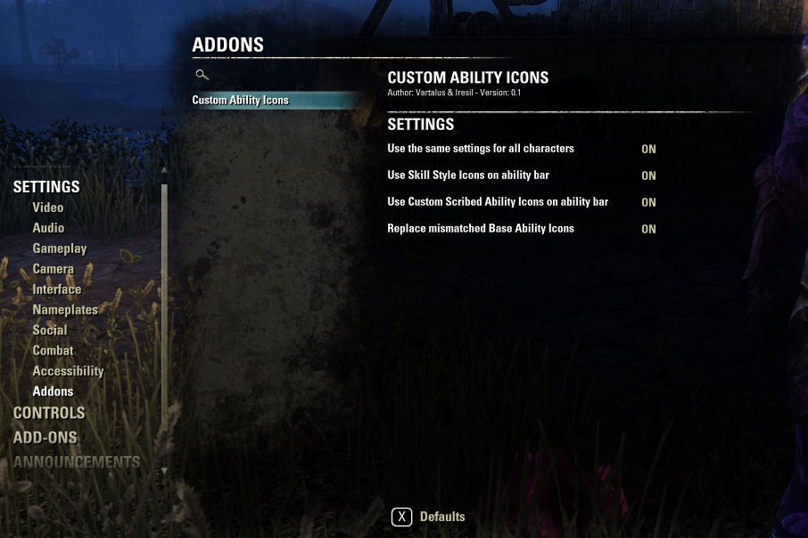
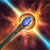
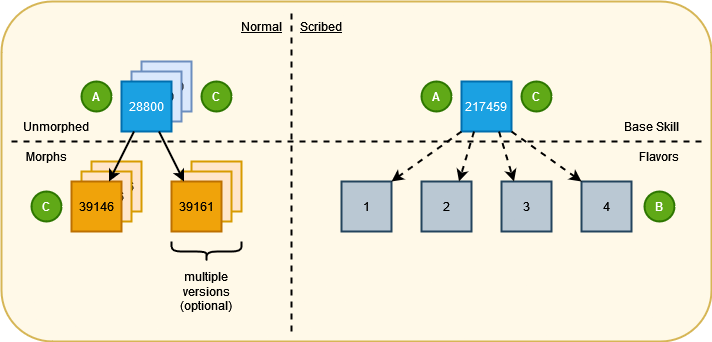

# CustomAbilityIcons
Enhances and customizes various skill icons for the Elder Scrolls Online (ESO) game.

## Description
This addon affects the following areas:
- **Skill Styles:** The skill's normal icon found in the ability bar can be replaced with the selected skill style icon.
- **Scribed Skills:** The appropriate recolor of the original icon of a scribed skill can be replaced, based on the focus script that's been used.
- **Base Game Icons:** Specifically for the destruction staff skill Pulsar (Impulse morph) while using a frost staff, the base game icon can be replaced with something a bit more frosty.

## Customization
This addon can use (but does not rely on) [**LibAddonMenu-2.0**](https://www.esoui.com/downloads/info7-LibAddonMenu-2.0.html) for customizing its in-game settings.

> [!IMPORTANT]
> If LibAddonMenu is not enabled, each one of the available settings will only be accessible via its corresponding chat command. All chat commands can accept the following as inputs:
> - **on** (or **off**)
> - **true** (or **false**)
> - **1** (or **0**)
>
> Using any of these input combinations enables (or disables) the corresponding setting.

If LibAddonMenu is enabled, the following settings screen will be available via
> *Settings -> Addons -> Custom Ability Icons*.



### Use the same settings for all characters
- **ON:** Any selections you make from the three options below will apply to all characters on your account (on both NA and EU servers).
- **OFF:** Any selections you make from the three options below will only apply to the character you're logged in as. You'll need to set these separately for all other characters.

> [!TIP]
> This can also be enabled using:
> ```
> /setoptionglobalicons on
> ```

### Use Skill Style Icons on ability bar
- **ON:** When a skill style is applied to an equipped active skill, the skill style icon _will_ appear as the skill's icon on your ability bar.
- **OFF:** When a skill style is applied to an equipped active skill, the skill style icon _will not_ appear on your ability bar.

> [!TIP]
> This can also be enabled using:
> ```
> /setoptionskillstyleicons on
> ```

### Use Custom Scribed Ability Icons on ability bar
- **ON:** When a scribed skill is equipped on your ability bar, a _recolored_ version of the base skill icon will be displayed on your ability bar. The icon colors have been selected based on each skill's visual effects, while also trying to preserve consistency with the existing skills.
- **OFF:** When a scribed skill is equipped on your ability bar, only the _base_ skill icon will be displayed.

> [!TIP]
> This can also be enabled using:
> ```
> /setoptioncustomicons on
> ```

### Replace mismatched Base Ability Icons

_(This only applies to the frost version of the **Pulsar** morph of the Destruction Staff skill **Impulse**, for the time being)_
- **ON:** A new icon will be displayed if you have a Frost Staff equipped.
- **OFF:** The default icon will be displayed regardless of the type of staff you're using.

> [!TIP]
> This can also be enabled using:
> ```
> /setoptionmismatchedicons on
> ```

## New Icons
### Scribed Skills
The following table contains a mapping of newly added (and base) icons to the corresponding Focus Script effect, per scribed skill. New icons have been created based on the visual effect colors added by each skill's possible Focus Scripts. One icon from each set has been configured as the default for that skill (based on the most often encountered color for the skill's possible Focus Script effects). In some cases the default icon is a new one and in some cases the default icon is the base skill icon.

> [!NOTE]
> **Torchbearer**: You can't use a Frost Damage focus script on Torchbearer, but it looked cool and one can only hope.
>
> **Ulfsild's Contingency**: Even though the base game icon looked nice, it wasn't consistent with the focus script visual effects. So it has been completely replaced by the new ones.

| Skill | &nbsp;&nbsp;Flame&nbsp;&nbsp;&nbsp; | &nbsp;&nbsp;Frost&nbsp;&nbsp;&nbsp; | &nbsp;&nbsp;Shock&nbsp;&nbsp;&nbsp; | &nbsp;&nbsp;Magic&nbsp;&nbsp;&nbsp; | &nbsp;&nbsp;&nbsp;Heal&nbsp;&nbsp;&nbsp; | Resources&nbsp; | &nbsp;Ultimate&nbsp; | &nbsp;&nbsp;&nbsp;Stun&nbsp;&nbsp;&nbsp; | Immobilize | &nbsp;&nbsp;Dispel&nbsp;&nbsp; | &nbsp;&nbsp;Shield&nbsp;&nbsp; | &nbsp;Physical&nbsp; | &nbsp;&nbsp;Bleed&nbsp;&nbsp;&nbsp; | &nbsp;&nbsp;Trauma&nbsp;&nbsp; | &nbsp;&nbsp;Poison&nbsp;&nbsp; | &nbsp;Disease&nbsp;&nbsp; | &nbsp;Default&nbsp;&nbsp; |
| --- | :---: | :---: | :---: | :---: | :---: | :---: | :---: | :---: | :---: | :---: | :---: | :---: | :---: | :---: | :---: | :---: | :---: |
| Elemental Explosion | ") | ") | ") | ") | | | | | | ") | | ") | | ") | | | ") |
| Mender's Bond | | | | ") | | ") | | | | | ") | | | | | | ") |
| Shield Throw | | ") | | ") | | | | | ") | | | | | | | | ") |
| Smash | | | | ") | ") | | | | | | ") | | ") | | | | ") |
| Soul Burst | | ") | ") | ") | ") | | | | ") | | ") | ") | | | | | ") |
| Torchbearer | ") | ") | | | ") | | ") | | | | | ") | ") | | | | ") |
| Trample | | | | ") | | | | ") | | ") | | ") | | ") | | ") | ") |
| Traveling Knife | | | | ") | | | | | | | | | ") | | ") | | ") |
| Ulfsild's Contingency | ") | ") | | ") | ") | | | | | | | | | | | | ") |
| Vault | ") | | | | ") | | | | | | | | | | ") | ") | ") |
| Wield Soul | | ") | ") | ") | ") | | | ") | | | ") | ") | | | | | ") |

### Base Game Skills
**Pulsar (Frost)**

| Skill | Old Icon | New Icon |
| --- | --- | --- |
| Pulsar |  | ")

## How It Works
This addon assumes that ESO skills comply with the structure displayed in the following diagram:



What the above means is that unmorphed skills exist on the same level as the base scribed skills (i.e. the scribed skill "foundation" on which the actual skill is built, after the scripts are added to it). It also means that every scribed skill flavor exists on the same level as morphed skills.

Assuming the above, the actions taken by this addon are applied in the following order:

**[A]** If any skill styles are selected for a slotted skill, the default skill icon gets replaced by the skill style icon _(provided that the corresponding setting has been selected)_. This can apply to both normal and scribed skills (even though no skill styles for scribed skills exist at the moment). This icon is always a version of the unmorphed skill icon and there aren't any different icons for morphed skills or scribed skill flavors.

**[B]** If a scribed skill is slotted and no skill styles are selected for it (that's always the case for the time being), then a custom icon is selected, based on the focus script that has been used during scribing _(provided that the corresponding setting has been selected)_.

**[C]** If none of the above conditions apply, the base skill icon may get replaced by a new one, if the original skill icon is deemed "mismatched" _(provided that the corresponding setting has been selected)_. Currently, this applies only to the frost version of the **Pulsar** morph of the Destruction Staff skill **Impulse**.
