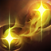
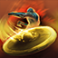
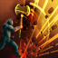
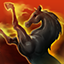
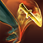
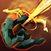
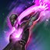

# CustomAbilityIcons
Enhances and customizes various skill icons for the Elder Scrolls Online (ESO) game.

## Description
This addon affects the following areas:
- **Skill Styles:** The skill's normal icon found in the ability bar can be replaced with the selected skill style icon.
- **Scribed Skills:** The appropriate recolor of the original icon of a scribed skill can be replaced, based on the focus script that's been used.
- **Base Game Icons:** Specifically for the destruction staff skill Pulsar (Impulse morph) while using a frost staff, the base game icon can be replaced with something a bit more frosty.

## Customization
This addon can use (but does not rely on) [**LibAddonMenu-2.0**](https://www.esoui.com/downloads/info7-LibAddonMenu-2.0.html) for customizing its in-game settings.

If LibAddonMenu is enabled, the following settings screen will be available via *Settings -> Addons -> Custom Ability Icons*.

The available options are the following:
> Use the same settings for all characters
- **ON:** Any selections you make from the three options below will apply to all characters on your account (on both NA and EU servers).
- **OFF:** Any selections you make from the three options below will only apply to the character you're logged in as. You'll need to set these separately for all other characters.

> Use Skill Style Icons on ability bar
- **ON:** When a skill style is applied to an equipped active skill, the skill style icon _will_ appear as the skill's icon on your ability bar.
- **OFF:** When a skill style is applied to an equipped active skill, the skill style icon _will not_ appear on your ability bar.

> Use Custom Scribed Ability Icons on ability bar
- **ON:** When a scribed skill is equipped on your ability bar, a _recolored_ version of the base skill icon will be displayed on your ability bar. The icon colors have been selected based on each skill's visual effects, while also trying to preserve consistency with the existing skills.
- **OFF:** When a scribed skill is equipped on your ability bar, only the _base_ skill icon will be displayed.

> Replace low quality Default Ability Icons

_(This only applies to the **Pulsar** morph of the Destruction Staff skill **Impulse**, for the time being)_
- **ON:** A new icon will be displayed if you have a Frost Staff equipped.
- **OFF:** The default icon will be displayed regardless of the type of staff you're using.

## New Icons
### Scribed Skills
One icon from each set has been configured as the default for that skill (based on the most often encountered color for the skill's possible Focus Scripts). In some cases the default icon is a new one and in some cases the default icon is the base skill icon.

| Skill | Flame&nbsp;&nbsp;&nbsp;&nbsp;&nbsp; | Frost&nbsp;&nbsp;&nbsp;&nbsp;&nbsp; | Shock&nbsp;&nbsp;&nbsp;&nbsp;&nbsp; | Magic&nbsp;&nbsp;&nbsp;&nbsp;&nbsp; | Heal&nbsp;&nbsp;&nbsp;&nbsp;&nbsp;&nbsp; | Resources&nbsp; | Ultimate&nbsp;&nbsp; | Stun&nbsp;&nbsp;&nbsp;&nbsp;&nbsp;&nbsp; | Immobilize | Dispel&nbsp;&nbsp;&nbsp;&nbsp; | Shield&nbsp;&nbsp;&nbsp;&nbsp; | Physical&nbsp;&nbsp; | Bleed&nbsp;&nbsp;&nbsp;&nbsp;&nbsp; | Trauma&nbsp;&nbsp;&nbsp;&nbsp; | Poison&nbsp;&nbsp;&nbsp;&nbsp; | Disease&nbsp;&nbsp;&nbsp; | Default&nbsp;&nbsp;&nbsp; |
| --- | --- | --- | --- | --- | --- | --- | --- | --- | --- | --- | --- | --- | --- | --- | --- | --- | --- |
| Elemental Explosion | ") | ") | ") | ") | | | | | | ") | | ") | | ") | | | ") |
| Mender's Bond | | | | ") | | ") | | | | | ") | | | | | |  |
| Shield Throw | | ") | | ") | | | | | ") | | | | | | | |  |
| Smash | | | | ") | ") | | | | | | ") | | ") | | | |  |
| Soul Burst | | ") | ") | ") | ") | | | | ") | | ") | ") | | | | | ") |
| Torchbearer | ") | ") | | | ") | | ") | | | | | ") | ") | | | | ") |
| Trample | | | | ") | | | | ") | | ") | | ") | | ") | | ") |  |
| Traveling Knife | | | | ") | | | | | | | | | ") | | ") | |  |
| Ulfsild's Contingency | ") | ") | | ") | ") | | | | | | | | | | | | ") |
| Vault | ") | | | | ") | | | | | | | | | | ") | ") |  |
| Wield Soul | | ") | ") |  | ") | | | ") | | | ") | ") | | | | | ") |

### Base Game Skills
**Pulsar (Frost)**

")
